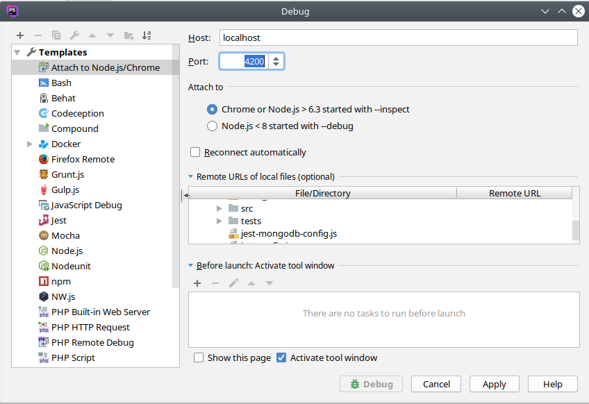

# Kickstart flavor: erebos (Angular NodeJS)

[](https://github.com/infracamp/kickstart-flavor-erebos/actions)
[](https://github.com/infracamp/kickstart-flavor-erebos/releases)
[](https://github.com/infracamp/kickstart-flavor-erebos)

***[Click here for information about basic kickstart usage](https://infracamp.org)***


Available Versions: (default `.kick.yml`: `from: "infracamp/kickstart-flavor-erebos"`)

| Tag  | Description |
|------|-------------|
| ***`infracamp/kickstart-flavor-erebos`*** (:latest)  | ***Last stable build (if unsure use this)*** |
| `infracamp/kickstart-flavor-erebos:testing`          | Nightly build - for testing only      |
| `infracamp/kickstart-flavor-erebos:release-1.0.1`    | Run explicit release                  |

## Preinstalled versions

| Package | Version |
|---------|---------|
| nodejs  | v13.1.0 |
| npm     | 6.12.1   |
| nodemon | 1.19.4  |

## Demo Project

- Available via `kickstart skel`:
    - `node_expresjs`: Basi hello world example with nodejs, nodemon 

## The Container comes with an nginx reverse_proxy mapping :8080 -> :80

## SIGTERM Trap
The container will catch SIGTERM signal and will gracefully shutdown if the webserver is idle or non-responsive

Steps executed when a SIGTERM signal is received

- Get the server status from the route /nginx-status
- Check the http response status code
    - if status code is not 200, terminate the container immediately(Web Server is already not responding)
- else (status code is 200), check in the http response body for requests being processed
    - if no requests are pending kill the container 
    - else sleep 2 seconds and start the steps from the beginning and will continue until the container is terminated with a SIGKILL signal

## HowTos

- [Typescript browser side debugging](doc/typescript-debugging.md)
- [Typescript lessons learned](doc/typescript-lessons-learned.md)


## Code debugging

To enable debugging, start nodemon with the `--inpect=0.0.0.0:4200` parameter.

This will start the debugger on Port `4200`.

### VSCode

Create a `.vscode/launch.json` in your project root. The `launch.json` needs to contain following content:
```json
{
    // Use IntelliSense to learn about possible attributes.
    // Hover to view descriptions of existing attributes.
    // For more information, visit: https://go.microsoft.com/fwlink/?linkid=830387
    "version": "0.2.0",
    "configurations": [
        {
            "type": "node",
            "request": "attach",
            "name": "Docker: Attach to Node",            
            "protocol": "auto",
            "port": 4200,
            "restart": true,
            "cwd": "${workspaceFolder}",
            "localRoot": "${workspaceFolder}/dist",
            "remoteRoot": "/opt/dist",
            "outFiles": [
                "${workspaceFolder}/dist/**/*.js"
            ],
            "skipFiles": [
                "<node_internals>/**/*.js",
            ]
        }
    ]
}
```


### IntelliJ




